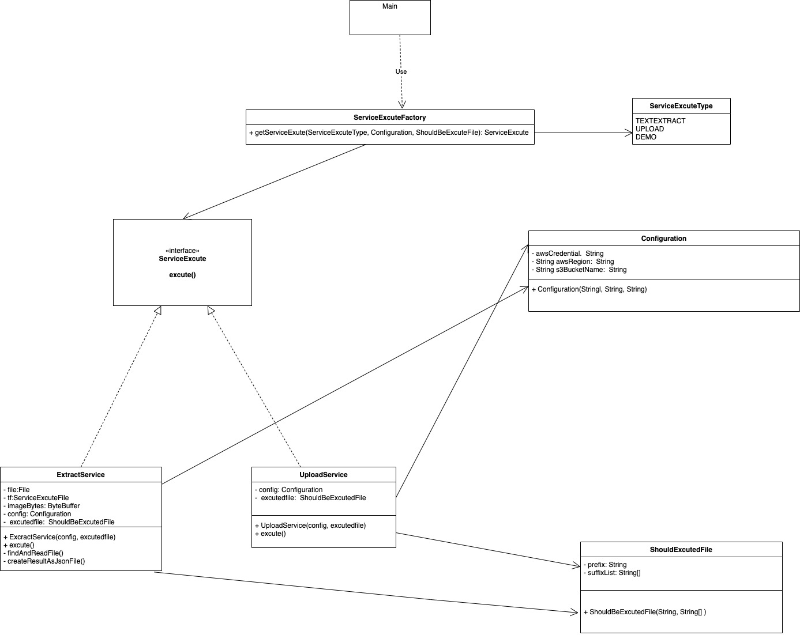
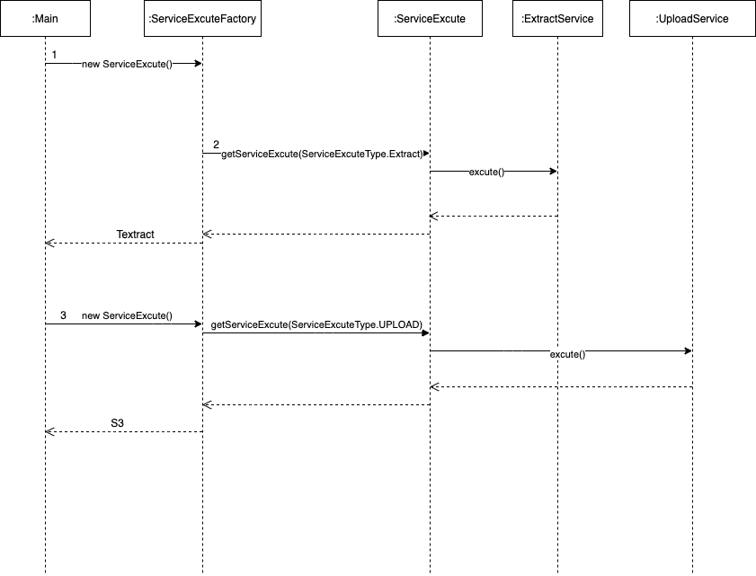

# BKPTest

project description
---

AWS Textract (ExtractService) will be implemented in this project to detect the text of an image. The local file will be first uploaded and create a tempFile. After running AWS Textract, all files include result (a JSON file) and the original printed or handwritten image will uploaded into AWS S3Bucket use UploadService. To use the AWS Service, credential with configured IAM (for Textract and S3) must be set up.

How to start the BKPTest application
---

1. Run `mvn clean install` to build your application
1. Create .env in root of project with following environment variables to use the AWS services

```
     CREDENTIAL_ENV_VAR=xxxxx
     REGION_ENV_VAR=xx-xx-x
     SERVICE_PROVIDER_ENV_VAR=name of package, for Example: AWS for com.xxx.AWS.TextextractService
     BUCKET_NAME_ENV_VAR=xxxxxxxxxxx
```
1. Start application with `java -jar target/bkptest-2.1.0-SNAPSHOT.jar server config.yml`
1. To check that your application is running enter URL `http://localhost:8080`

Health Check
---

To see your applications health enter URL `http://localhost:8081/healthcheck`


UML Diagram
---



Sequence Diagram
---

